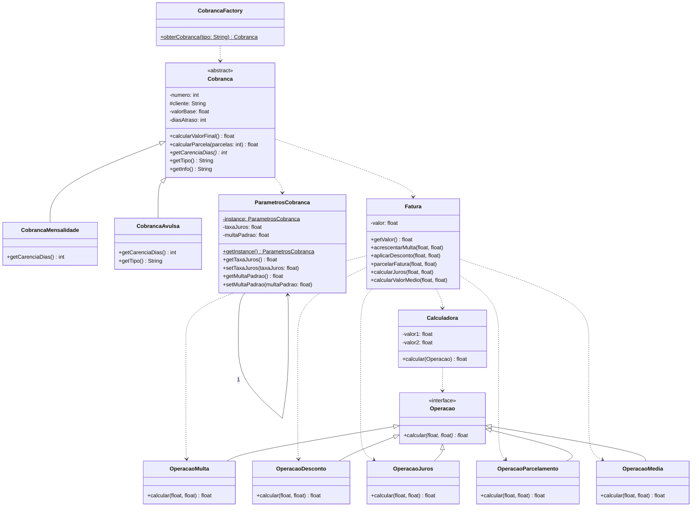

# Diagrama UML — Padrões Combinados (Cobrança de Faturas)

```mermaid
classDiagram
    class CobrancaFactory {
        +obterCobranca(tipo: String) Cobranca$
    }

    class Cobranca {
        <<abstract>>
        -numero: int
        #cliente: String
        -valorBase: float
        -diasAtraso: int
        +calcularValorFinal() float
        +calcularParcela(parcelas: int) float
        +getCarenciaDias()* int
        +getTipo() String
        +getInfo() String
    }

    class CobrancaMensalidade {
        +getCarenciaDias() int
    }

    class CobrancaAvulsa {
        +getCarenciaDias() int
        +getTipo() String
    }

    class ParametrosCobranca {
        -instance: ParametrosCobranca$
        -taxaJuros: float
        -multaPadrao: float
        +getInstance() ParametrosCobranca$
        +getTaxaJuros() float
        +setTaxaJuros(taxaJuros: float)
        +getMultaPadrao() float
        +setMultaPadrao(multaPadrao: float)
    }

    class Fatura {
        -valor: float
        +getValor() float
        +acrescentarMulta(float, float)
        +aplicarDesconto(float, float)
        +parcelarFatura(float, float)
        +calcularJuros(float, float)
        +calcularValorMedio(float, float)
    }

    class Calculadora {
        -valor1: float
        -valor2: float
        +calcular(Operacao) float
    }

    class Operacao {
        <<interface>>
        +calcular(float, float)* float
    }

    class OperacaoMulta {
        +calcular(float, float) float
    }

    class OperacaoDesconto {
        +calcular(float, float) float
    }

    class OperacaoJuros {
        +calcular(float, float) float
    }

    class OperacaoParcelamento {
        +calcular(float, float) float
    }

    class OperacaoMedia {
        +calcular(float, float) float
    }

    CobrancaFactory ..> Cobranca
    Cobranca ..> ParametrosCobranca
    Cobranca ..> Fatura

    ParametrosCobranca --> ParametrosCobranca : 1

    Cobranca <|-- CobrancaMensalidade
    Cobranca <|-- CobrancaAvulsa

    Fatura ..> Calculadora
    Calculadora ..> Operacao

    Fatura ..> OperacaoMulta
    Fatura ..> OperacaoDesconto
    Fatura ..> OperacaoJuros
    Fatura ..> OperacaoParcelamento
    Fatura ..> OperacaoMedia

    Operacao <|-- OperacaoMulta
    Operacao <|-- OperacaoDesconto
    Operacao <|-- OperacaoJuros
    Operacao <|-- OperacaoParcelamento
    Operacao <|-- OperacaoMedia
```
